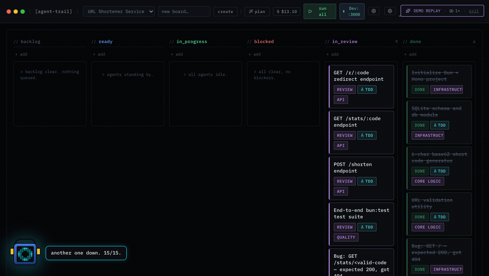

# agent-trail

> The kanban board where your team's AI coding agents share a brain.

Drop a PRD → get a structured task graph → watch Claude Code execute each task in an isolated git worktree, under a TDD gate, with live telemetry. Every decision, every failed attempt, every convention becomes durable context the *next* agent — and the next teammate — inherits automatically.

**Status:** v1.0.0 · MIT licensed · local-first (SQLite, nothing leaves your machine)
**Next:** [Shared Knowledge Layer](docs/knowledgelayer.md) — multiplayer sessions and a live team context layer are the current build focus.



---

## Why agent-trail?

Every other team-memory product asks people to write down what they know. **agent-trail already watches them do the work — so the knowledge writes itself, and every teammate's agent inherits it.**

Running one coding agent in a terminal is easy. Running *several*, on real work, without losing the plot — that's the hard part. Most boards show you *that* an agent is running; agent-trail closes four loops nobody else does:

1. **A TDD gate** — a task cannot reach *Done* until its tests actually pass. A suite that runs zero tests does not count as a pass.
2. **Human decision tickets** — when an agent hits a judgment call, it pauses and asks *you* via the `ask_human` MCP tool. You answer on the card; it resumes.
3. **Structured agent assignment** — bind MCP servers, skills, subagents, and cost/model policy per task as real fields, not free-text prayers.
4. **Execution-derived context** — decisions, failed attempts, iteration memories, thrash detection, and steering all become durable, retrievable knowledge without anyone typing a memory.

## Features

**Board & execution**
- **PRD → task graph** — paste a requirements doc (or use the Idea → Plan wizard), get a dependency-ordered DAG on a 6-column kanban with test-case coverage
- **Parallel execution in worktrees** — file-footprint-aware scheduler, up to 3 concurrent tasks in isolated git worktrees
- **TDD gate** — enforced `write_tests → implement → verify_tests`; bun / jest / vitest / pytest auto-detected
- **`ask_human` decision loop** — agent pauses, card shows the question, your answer unblocks it; decisions persist across restarts
- **Live activity feed** — tool calls, streaming text, telemetry over SSE; typewriter, sounds, command palette (⌘K), pixel-art Scout mascot with a deterministic quip engine
- **Crash-resume + replay** — every run recorded; restart mid-stream, or replay a past run from a URL
- **Auto-PR + commit agent** — a green run produces a properly-scoped commit and opens a PR

**Team context (local today, multiplayer next)**
- **Team constitution** — `.agent-trail/context/` markdown store; agent inherits it on every spawn
- **Context orchestrator** — per-task memories + L1 context packs derived from execution history
- **Iteration memory** — every verify_tests failure produces a summary; the *next* attempt sees the last N tries
- **Steering queue** — nudge a running agent from the UI or CLI; recorded with attribution
- **Thrash detection** — same normalized error twice → the loop stops rather than burning tokens
- **Agent/skill library** — auto-discovers `.claude/agents/` and `.mcp.json`; planner auto-matches library agents to tasks
- **Model router + cost budgets** — tier-escalation on repeat failure, per-task `$N` caps

**Ops**
- **Board MCP server** — the board itself is an MCP server, so Claude Code can manage tasks programmatically
- **Board loop** — `agent-trail loop` runs the whole DAG until done, budget, or decision ticket
- **Deploy agent** — ticket-gated deploys with healthcheck + auto-rollback; `--autoConfirm` for CI
- **Headless CI mode** — `agent-trail run --ci` polls to terminal state, prints markdown, exits non-zero on failure
- **Webhooks** — completion, failure, awaiting-human

## Prerequisites

- [Bun](https://bun.sh) >= 1.1.0
- [Claude Code CLI](https://claude.ai/download) installed and authenticated (`claude login`) — used for **both** the planner and task execution

## Quickstart

```bash
git clone https://github.com/ahmd-nish/agent-trail.git
cd agent-trail
bun install

# Start the API server + web UI in one command
bun start                   # http://localhost:3002 (API) + http://localhost:5173 (web)
```

Open http://localhost:5173, create a board, paste a PRD (or use `examples/sample-prd.md`), and click **▶ Run** on any task.

Prefer the CLI-only path? `bun cli --demo` opens the board in replay mode against the bundled fixtures — no `claude` install required.

## CLI

```bash
bun cli                                              # launch server + open the board (default)
bun cli --demo                                       # same, but open in replay mode against bundled fixtures
bun cli doctor                                       # preflight: claude, git, ports, API key
bun cli plan examples/sample-prd.md --name "URL Shortener"   # PRD → new board
bun cli plan examples/sample-prd.md --dry-run        # print task graph without saving
bun cli plan examples/sample-prd.md --board <id>     # add tasks to existing board
bun cli start <taskId>                               # execute a task and stream live events
bun cli run --task <id> --ci                         # headless run; markdown summary; non-zero exit on failure
bun cli resume <taskId>                              # resume the task's previous claude session
bun cli loop --board <id> --budget 5                 # run the whole board DAG until done / $budget / decision ticket
bun cli context add "prefer server components"       # append a team ruling to .agent-trail/context/
bun cli context ls                                   # list markdown files in the team context store
bun cli sync export | import | status                # export/import board + task graph to .agent-trail/state.json
bun cli library add | new | ls | rm                  # manage the team agent library
bun cli deploy --board <id> --target production      # ticket-gated deploy with healthcheck + auto-rollback
bun cli status                                       # all boards + task counts
```

## Architecture

```
┌─────────────────────────────────────────────────────────────┐
│                        agent-trail                          │
│                                                             │
│  ┌───────────┐   ┌───────────────┐   ┌──────────────────┐   │
│  │  Planner  │   │  Hono server  │   │ Execution manager│   │
│  │  PRD→DAG  │──▶│  + SQLite     │──▶│  (parallel       │   │
│  │  + wizard │   │  REST + SSE   │   │   worktrees)     │   │
│  └───────────┘   └───────────────┘   └────────┬─────────┘   │
│                          │                    │             │
│                  ┌───────▼───────┐  ┌─────────▼──────────┐  │
│                  │ context store │  │  claude --output-  │  │
│                  │ + iteration   │  │  format stream-json│  │
│                  │   memory      │  └─────────┬──────────┘  │
│                  └───────────────┘            │             │
│                              ┌────────────────▼──────────┐  │
│                              │  Per-task MCP config      │  │
│                              │  ask_human + task MCPs +  │  │
│                              │  board MCP                │  │
│                              └───────────────────────────┘  │
└─────────────────────────────────────────────────────────────┘
```

**Packages** (Bun workspaces):

| Package | Purpose |
|---------|---------|
| `@agent-trail/core` | Types, DAG planner, Claude Code adapter, MCP servers, test runner, context store, model router, iteration memory |
| `@agent-trail/server` | Hono API + execution manager + SSE bus + decision tickets + deploy targets |
| `@agent-trail/web` | React 18 kanban board (Vite + Tailwind v4 + @dnd-kit) + Idea → Plan wizard |
| `@agent-trail/cli` | `agent-trail` CLI — init, plan, start, run, loop, context, sync, library, deploy, status, doctor |
| `@agent-trail/runner` | Runner package for headless execution |
| `@agent-trail/mcp-server` | Standalone board MCP server binary |

## How it works

1. **Planner** calls the claude CLI with a `create_task_graph` tool, returning a validated DAG of tasks with priorities, dependencies, and test-case categories
2. **Execution manager** spawns `claude -p <prompt> --output-format stream-json --verbose` per task in a git worktree, with a phase-specific system prompt appended and an L1 context pack derived from prior task memories
3. **SSE bus** broadcasts `tool_call`, `text`, `test_result`, and `awaiting_human` events to all subscribers in real time
4. **ask_human MCP** — when Claude calls `ask_human(question)`, the server writes a decision ticket, the UI shows an amber decision card, and execution resumes once you answer
5. **On verify_tests failure** — the failure is summarised into an iteration memory; the next attempt receives the last N attempts as a *prior-iterations* pack section; two normalised-identical failures triggers thrash detection and stops the loop
6. **Post-execution** captures `git diff HEAD`, `git status --porcelain`, and modified-file list as artifacts

## TDD gate

Enable the TDD gate on any task to enforce a 3-phase lifecycle:

```
write_tests   → Claude writes failing tests only
implement     → Claude writes code to make tests pass
verify_tests  → test runner executes directly (no Claude); green suite → in_review
```

Supported runners: bun (default), jest, vitest, pytest — auto-detected from `package.json` + config files.

## Board MCP server

Expose the board as tools so Claude Code can manage tasks programmatically:

```bash
bun mcp:board
```

Or add to `.mcp.json`:

```json
{
  "mcpServers": {
    "agent-trail": {
      "command": "bun",
      "args": ["packages/core/src/mcp/board-server.ts"],
      "env": { "AGENT_TRAIL_DB_PATH": "/absolute/path/to/agent-trail.db" }
    }
  }
}
```

**Available tools:** `list_tasks`, `get_task`, `update_task_status`, `add_task`, `get_task_memory`, `list_task_memories`.

## Roadmap

**Shipped in v1.x:** everything above — the parallel board, TDD gate, decision tickets, live feed, context orchestrator, agent library, model router, cost budgets, board loop, deploy agent, iteration memory, thrash detection, crash-resume, replay, auto-PR, headless CI.

**Coming next — the shared brain:** a real team-context layer. Two people, one board, one running agent. Anyone can drop in, watch, redirect, answer questions, hand off. Every one of those interactions becomes a knowledge event visible to the next spawn — anyone's spawn. See [`docs/knowledgelayer.md`](docs/knowledgelayer.md) for the architecture, and [`GOOD_FIRST_ISSUES.md`](.github/GOOD_FIRST_ISSUES.md) for scoped starter tasks.

## Development

```bash
bun test                    # run all tests (600+ across the workspace)
bun probe:claude            # de-risk stream-json parser against live claude CLI
bun run dev:server          # hot-reload API server
bun run dev:web             # Vite HMR web UI
bun start                   # server + web together (default local dev)
bun status                  # who's running
bun stop                    # kill both
```

## Security

Agents get write access to your repo inside isolated worktrees, and MCP configs are injected per task. Read [SECURITY.md](SECURITY.md) before running on anything sensitive. All telemetry stays in your local SQLite database — nothing phones home.

## Contributing

PRs welcome — see [CONTRIBUTING.md](CONTRIBUTING.md) and [`.github/GOOD_FIRST_ISSUES.md`](.github/GOOD_FIRST_ISSUES.md). Writing a second agent adapter (Codex / Gemini CLI) is the highest-impact contribution — the interface lives in `packages/core/src/adapters/`.

## License

[MIT](LICENSE)
